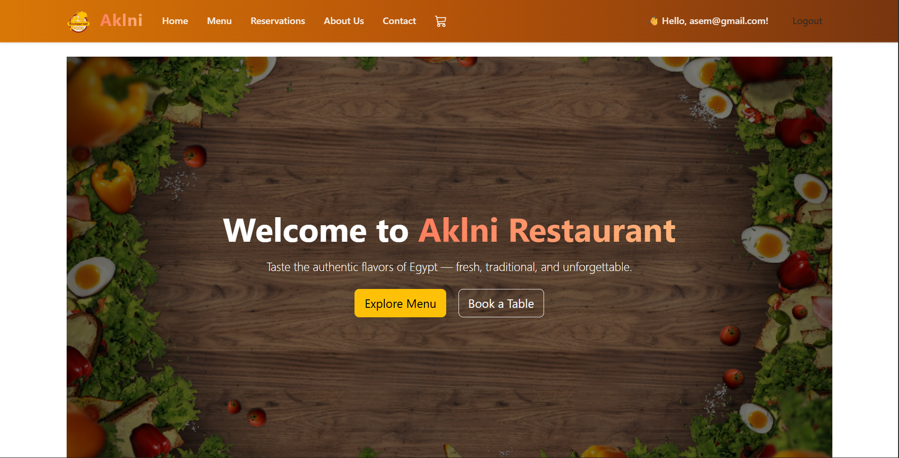
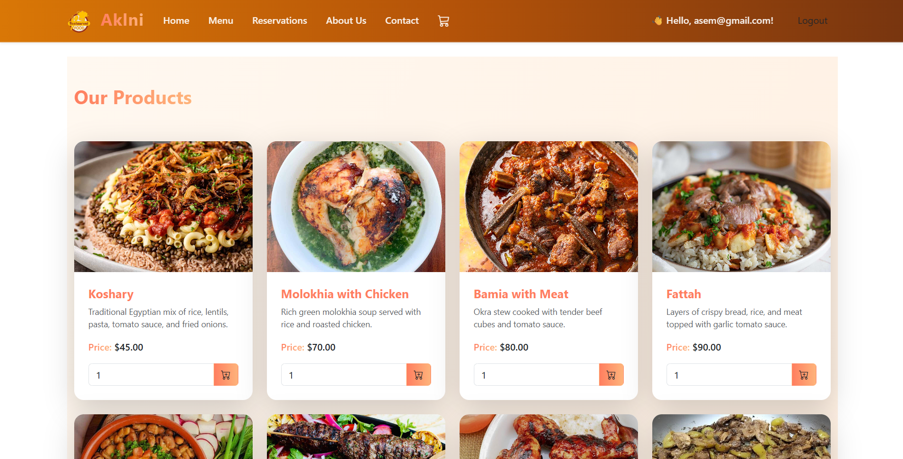
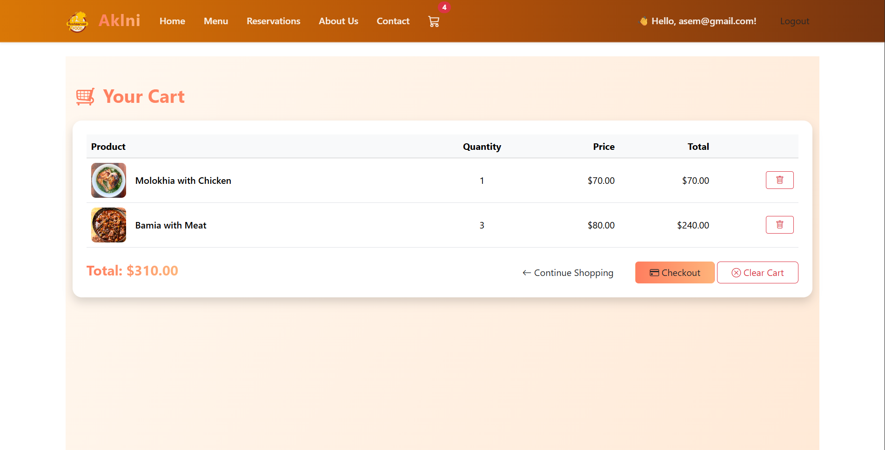

# 🍽️ Aklni Restaurant

_A modern web application bringing the flavors of Egyptian cuisine online._

---

## 📋 Table of Contents

- [About](#about)
- [Features](#features)
- [Demo / Screenshots](#demo--screenshots)
- [Tech Stack](#tech-stack)
- [Contributing](#contributing)
- [License](#license)
- [Contact](#contact)

---

## 🧾 About

**Aklni Restaurant** is a web-based restaurant management and ordering system built with **ASP.NET Core MVC**.  
It allows users to explore traditional Egyptian dishes, view details, and manage their orders effortlessly.  
The platform provides a smooth and responsive user experience with a focus on clarity, usability, and modern design.

---

## ✨ Features

- 🍛 Browse a curated menu of Egyptian dishes.
- 📖 View detailed descriptions, ingredients, and dish images.
- 🛒 Add items to your cart, modify quantities, and place orders.
- 👩‍💼 Admin panel for managing menu items and tracking orders.
- 📱 Fully responsive design that adapts to desktop and mobile.
- ⚙️ Clean, modular code using the MVC architecture.

---

## 🖼️ Demo / Screenshots

> 💡 _Replace the placeholder image paths below with your actual screenshots._

### 🏠 Home Page

_The welcoming homepage._

### 📋 Menu Listing

_Browse a variety of Egyptian dishes available._

### 🍲 Dish Details

_Detailed view of a selected ingredient with description and ingredients._

### 🛍️ Cart / Order Management

_Review selected items, and confirm your order._

---

## 🧰 Tech Stack

| Layer        | Technology                         |
| ------------ | ---------------------------------- |
| **Backend**  | ASP.NET MVC / C#                   |
| **Frontend** | HTML5, CSS3, JavaScript, Bootstrap |
| **Database** | SQL Server                         |
| **Tools**    | Visual Studio                      |

---

## 🚀 Getting Started

### ⚙️ Prerequisites

Make sure you have these installed:

- [.NET SDK](https://dotnet.microsoft.com/en-us/download) (version 8.0 or later)
- SQL Server
- Git

---

## 🤝 Contributing

Contributions to implement the planned features above are greatly appreciated!  
If you'd like to add Contact, About, Footer, Reservation Feature or build the Admin Dashboard, You Are Welcome

## 📜 License

Copyright (c) 2025 Assem Bakr

---

## 📬 Contact

**Author:** [Assem Bakr](https://github.com/assembakr)  
📧 Email: [asem.abdelhamid@ejust.edu.eg]

> “Aklni” means _“Feed Me”_ in Arabic — and this project feeds your hunger for code and cuisine alike. 🍴
